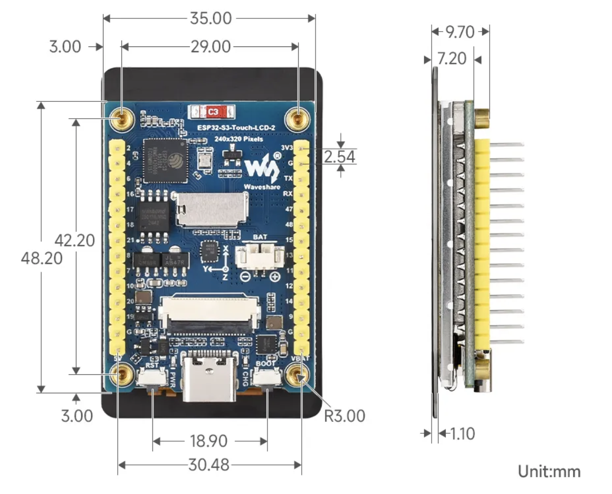

# StajPilot — Waveshare ESP32-S3-Touch-LCD-2

[← back to all boards](../)

▶️ **[Watch on YouTube](https://youtu.be/kLVWh-ry95s)**

Touchscreen MIDI controller for the Kemper Profiler Player, built on a
Waveshare ESP32-S3-Touch-LCD-2 (2" 320×240 touch LCD). The board itself
costs around **$15**, and still gives you full touch control - a low-cost,
low-risk way to try StajPilot.

**🚧 Coming soon — firmware releases for this board aren't published yet.**
This page will be filled in with download links, flashing instructions,
and hardware notes once the first release is out.

Questions in the meantime? DM on [Instagram](https://www.instagram.com/stajpilot) —
answered as soon as seen.

## Features

- Bank/rig navigation — 125 song banks × 5 slots, on-screen buttons or
  bank next/prev, confirmed against the Kemper's own reply rather than
  assumed
- Live rig display — rig name, amp name, gain (10-step color gradient),
  tempo, and fixed-FX on/off state, all pulled live from the Kemper
- Tuner with two modes: **Normal** (integer cents, standard ±2 in-tune
  threshold) and **Fine-Tune** (real sub-cent precision, finer graduated
  bar, tighter in-tune/near-tune bands)
- Tap tempo, including a long-press numeric keypad to type an exact BPM
  and optionally switch the Kemper onto it directly
- Morph — press the already-active slot again to trigger Morph instead
  of reloading the rig
- Bluetooth MIDI central mode — up to 5 BLE MIDI foot controllers
  forwarded to the Kemper over USB, with an optional MIDI-only scan
  filter
- WiFi song-config page for labeling banks/slots by song, same as the
  4.3" board's Song Mode
- Settings: brightness, Song Mode, effect-transition animations, and
  tuner Fine-Tune mode all toggle independently

## MIDI communication with the Kemper Player

StajPilot runs in the Kemper Player's bi-directional mode and relies as
much as possible on the data it streams automatically, rather than
polling for it - it's best to avoid heavy request traffic while in
bi-directional mode. Some detailed data isn't part of
that auto-stream and still needs a direct request; those requests are
kept optional where possible, so users can choose to skip them. The
whole MIDI layer is built around stability and keeping load on the
Kemper Player's own system low - the streamed data itself stays
real-time, this is about not piling extra requests on top of it.

## Hardware

- Waveshare ESP32-S3-Touch-LCD-2
- ESP32-S3, native USB + native Bluetooth (no companion chip needed)
- 2" 320×240 touch LCD
- The back of the board is exposed - for now, a simple M2-standoff
  spacer and cover, 3D-printed in plastic, is enough to close it up.
  Drawings for a laser-cut acrylic cover are planned and will be
  provided soon.

  
