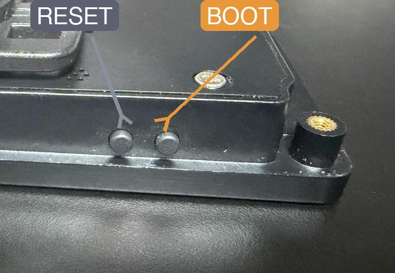
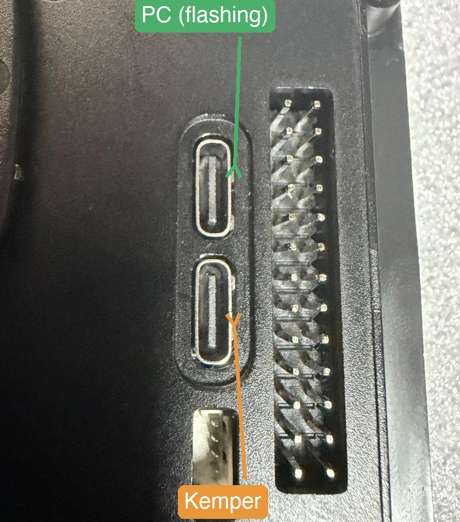

# StajPilot — Guition JC4880P443C_I_W_Y (rev1.3)

[Read in English](README.md)

<a href="https://www.youtube.com/watch?v=ZbDjtYzA_fI" target="_blank">
  
</a>

▶️ **[YouTube로 보기](https://www.youtube.com/watch?v=ZbDjtYzA_fI)**

캠퍼 프로파일러 플레이어용 터치스크린 MIDI 컨트롤러입니다. ESP32-P4 +
ESP32-C6(Guition JC4880P443C_I_W_Y, 4.3인치 800×480 터치 LCD) 기반으로
만들어졌습니다. P4 칩 덕분에 4.3인치 큰 화면도 여유롭게 구동하면서도,
보드 자체는 가벼워서 페달보드나 리그 위에 올려놔도 부담스럽지 않습니다.
WiFi와 블루투스도 별도의 컴패니언 칩(ESP32-C6)으로 내장되어 있어서
추가 모듈이 따로 필요 없습니다.

> ⚠️ **구매 전에 보드 리비전을 판매자에게 꼭 확인하세요.**
> 이 펌웨어는 Guition JC4880P443C_I_W_Y의 **rev1.3**에 맞춰 빌드·테스트된
> 것입니다. 다른 리비전은 핀 배치와 부품이 다를 수 있고 **작동을 보장하지
> 않습니다.** 주문 전에 판매자에게 rev1.3이 맞는지 확인하세요.
>
> **모델명으로 케이스 포함 여부도 알 수 있습니다**: 모델명 끝에 **`_Y`**가
> 붙으면(예: `JC4880P443C_I_W_Y`) 케이스가 포함된 것이고, `_Y`가 없으면
> (`JC4880P443C_I_W`) 보드만 있는 것입니다. 직접 케이스를 만들거나 따로
> 구하실 게 아니라면 **`_Y`** 버전을 구매하시고, 주문 전에 상품 페이지에서
> 케이스 포함 옵션을 다시 한번 확인하세요.

현재는 캠퍼 프로파일러 **Player LV3**에서만 테스트되었습니다 - 다른
프로파일러 모델(Stage, PowerHead, Rack)에서는 검증되지 않았습니다.

## 기능

- 5개 퍼포먼스 슬롯을 이용한 뱅크/릭 탐색 + 탭 템포 + 튜너
- 슬롯별 이펙트 온/오프 실시간 표시, 애니메이션 아이콘 등장 효과
  (CPU를 아끼고 싶으면 끌 수 있음)
- microSD 카드에서 불러오는 앰프 아트 표시(현재 안정화 작업 중 - 다음
  업데이트에서 다시 활성화 예정). **아직 베타 단계** - 이미지는 아무거나
  넣는 게 아니라 정해진 포맷/스펙(크기, 파일 형식 등)을 따라야 합니다.
  정확한 요구사항은 아직 확정 중이며, 이 기능이 완전히 재활성화되기 전에
  문서화될 예정입니다.
- **송 모드** - 캠퍼 프로파일러 플레이어에는 곡 개념이 따로 없고 뱅크/
  슬롯만 있습니다. StajPilot은 그 위에 간단한 송 모드를 추가해서, WiFi
  설정 페이지에서 각 뱅크/슬롯에 곡 이름, 서브 라벨, 앰프 아트 파일을
  붙일 수 있게 해줍니다 - 평소 쓰던 뱅크/슬롯 탐색 그대로 곡 정보도 같이
  보여주며, 기기 자체 화면을 직접 건드릴 필요가 없습니다. 이건 슬롯별
  라벨링일 뿐, 순서를 편집할 수 있는 셋리스트 기능은 아닙니다.
- 무선 풋컨트롤러용 블루투스 MIDI 지원 - M-VAVE Chocolate 페달 3개를
  동시에 연결해서 테스트했고, 최대 5개까지 지원

## 캠퍼 플레이어와의 MIDI 통신

StajPilot은 캠퍼 플레이어의 양방향(bi-directional) 모드로 동작하며,
직접 요청을 보내기보다는 캠퍼가 자동으로 스트리밍해주는 데이터를 최대한
활용합니다 — 양방향 모드일 때는 무거운 요청 트래픽을 피하는 게
좋습니다. 일부 상세 데이터는 이 자동 스트림에 포함되지
않아 직접 요청이 필요한데, 이런 요청들은 가능한 한 선택적으로 두어서
사용자가 원하면 끌 수 있게 했습니다. 전체 MIDI 레이어는 안정성과 캠퍼
플레이어 자체 시스템에 걸리는 부하를 낮게 유지하는 데 중점을 두고
설계되었습니다 — 스트리밍되는 데이터 자체는 계속 실시간으로 유지되고,
그 위에 추가 요청을 쌓지 않는 것이 핵심입니다.

## 설치하기

**가장 쉬운 방법: 브라우저에서 바로 플래시** — 별도 소프트웨어 설치 없이,
크롬이나 엣지 데스크톱 브라우저만 있으면 됩니다:

### 👉 [stajd.github.io](https://stajd.github.io/)

목록에서 "Guition JC4880P4"를 선택한 다음:

1. 보드의 **BOOT** 버튼을 누른 채로 유지하세요. 누른 상태에서 USB-C
   케이블을 **위쪽** USB-C 포트(아래 사진에서 PC라고 표시된 포트)에
   연결하세요 — 아래쪽 포트는 캠퍼 연결용입니다. 화면을 확인하세요:
   **까맣게(빈 화면)** 바뀌어야 합니다 — 이게 성공했다는 신호이고
   보드가 업로드 모드에 들어간 것입니다(평소 화면이 그대로 보인다면
   실패한 것이니 다시 시도하세요). 화면이 까매지면 BOOT 버튼을 2초 정도
   더 누르고 있다가 그다음에 손을 떼세요.

   
   

2. 사이트에서 **Connect & Flash**를 클릭하세요.
3. 팝업창에 컴퓨터의 모든 포트가 나열됩니다 — 이 보드에 해당하는 포트를
   선택하고 **Connect**를 클릭하세요.
   - **Mac에서는**: `usbmodem`과 `USB JTAG/serial debug unit`이 함께
     포함된 항목 하나를 찾으세요 — 예를 들면
     `cu.usbmodem83101 USB JTAG/serial debug unit`처럼요.
     `Bluetooth-Incoming-Port`나 `debug-console`은 무시하세요 —
     보드가 아닙니다.
   - **Windows에서는**: 포트가 설명 없이 그냥 `COM3`, `COM4` 등으로
     표시됩니다. 어떤 것인지 확실하지 않다면, 보드를 뽑아서 목록에서
     사라지는 포트를 확인한 다음, 다시 꽂고 그 포트를 선택하세요.
4. **Install**을 클릭하세요. 기기를 지울지(erase) 묻는 창이 뜹니다.
   - **이 보드에 처음 설치하시나요?** 체크하세요 — 아직 저장된 게
     없어서 잃을 것도 없고, 깨끗한 상태로 시작할 수 있습니다.
   - **이미 StajPilot을 쓰고 있고 업데이트만 하시나요?** 체크하지 않은
     상태로 두세요 — 그래야 저장된 설정과 곡 목록이 유지됩니다.
     그다음 **Next**를 클릭하세요.
5. 플래싱이 끝날 때까지 기다리세요 — 진행 중에는 보드를 뽑지 마세요.
6. "Installation complete!"가 뜨면 **Next**를 클릭하세요(버튼이
   그것뿐입니다). 그러면 "Install..."과 "Logs & Console"이 있는
   메뉴로 넘어가는데, 이건 처음 시작할 때와 똑같이 생긴 이 도구의
   기본 메뉴일 뿐이에요 — 아무것도 누르지 마시고, 모서리의 **X**로
   닫으시면 됩니다.
7. 위쪽(PC) 포트에서 케이블을 뽑고, 아래쪽(캠퍼) 포트를 평소처럼
   캠퍼에 연결하세요 — 그러면 새 펌웨어로 실행이 시작됩니다.

### esptool로 수동 설치

명령줄에서 직접 플래시하고 싶으시다면:

1. [esptool](https://github.com/espressif/esptool) 설치:
   `pip install esptool`.
2. 이 보드용 최신 릴리즈를
   [Releases](../../../releases) 페이지에서 받으세요(태그명
   `VX.XX.XX_stajPilot(JC4880P443C_I_W)`). 각 릴리즈에는:
   - `stajpilot_vX.XX.XX_JC4880P443C_I_W_update_firmware.bin` — 앱만
     업데이트. 이미 작동 중인 설치본이 있고 새 버전만 원할 때 사용 -
     곡 목록, WiFi 설정, 기타 저장된 설정을 유지합니다.
   - `stajpilot_vX.XX.XX_JC4880P443C_I_W_factory_merged.bin` — 전체
     이미지(부트로더 + 파티션 테이블 + 앱). 처음 설치하거나 완전
     복구할 때만 사용하세요 - **저장된 곡/WiFi 설정이 지워집니다.**
3. 보드를 업로드 모드로 진입시키기: USB 케이블을 뽑고, **BOOT** 버튼을
   누른 채로, 케이블을 **위쪽** USB-C 포트에 다시 꽂으세요(아래쪽
   포트는 캠퍼 연결용이라 플래싱용이 아닙니다 - 아래 사진 참고). 화면이
   **까맣게(빈 화면)** 바뀌어야 성공한 것입니다. BOOT를 2초 정도 더
   누르고 있다가 손을 떼세요.

   
   

4. 보드의 시리얼 포트 확인: Mac에서는 `/dev/cu.usbmodem83101`처럼,
   Windows에서는 `COM3`, `COM4` 등으로 표시됩니다(확실하지 않다면
   보드를 뽑아서 `esptool.py --port` 자동탐지나 OS의 장치 목록에서
   사라지는 포트를 확인하세요.)
5. 그 포트로 `<PORT>`를 바꿔서 아래 명령어를 실행하세요:

   **일반 업데이트** (곡 목록/WiFi 설정 유지):
   ```
   esptool.py --chip esp32p4 --port <PORT> --baud 460800 \
     write_flash 0x10000 stajpilot_vX.XX.XX_JC4880P443C_I_W_update_firmware.bin
   ```

   **초기 설치 / 복구** (처음 설치하거나 완전 초기화):
   ```
   esptool.py --chip esp32p4 --port <PORT> --baud 460800 \
     write_flash 0x0 stajpilot_vX.XX.XX_JC4880P443C_I_W_factory_merged.bin
   ```
6. **위쪽(PC)** 포트에서 케이블을 뽑고, **아래쪽(캠퍼)** 포트를 평소처럼
   캠퍼에 연결하세요 — 그러면 새 펌웨어로 실행이 시작됩니다.

각 릴리즈 노트에 그 버전에서 바뀐 내용이 설명되어 있습니다.

## 하드웨어

- Guition JC4880P443C_I_W_Y, rev1.3
- ESP32-P4 + ESP32-C6 WiFi/BT 컴패니언
- 4.3인치 800×480 RGB 터치 LCD
- 앰프 아트 이미지용 microSD 카드 슬롯(선택 사항 - 없어도 기기는
  정상 작동합니다)

## 송 모드 설정

캠퍼 프로파일러 플레이어는 뱅크와 슬롯만 알고 있습니다 - 송 모드는
StajPilot만의 추가 기능으로, 그 같은 뱅크/슬롯 구조에 곡 이름을 붙일 수
있게 해줍니다. 기기의 설정 화면에서 WiFi 설정 모드를 켜고, 기기가
브로드캐스트하는 `StajPilot` WiFi 네트워크에 휴대폰이나 컴퓨터를
연결한 다음, 웹 브라우저에서 `192.168.4.1`을 여세요 - 곡을 한번에 많이
입력할 거라면 컴퓨터 키보드가 훨씬 빠릅니다. 거기서 곡 이름, 슬롯별
라벨, 각 뱅크에 표시할 앰프 아트 파일을 설정할 수 있고 - 기존에 쓰던
뱅크/슬롯 탐색에서 그 곡 정보도 함께 보여줍니다. 순서를 편집할 수 있는
별도의 셋리스트는 없습니다 - 그냥 각 뱅크/슬롯에 붙는 라벨일 뿐입니다.


## StajPilot 후원하기

캠퍼 업데이트 대응, 신규 보드 개발, 재미있는 기능 추가까지 — StajPilot이
계속 발전하려면 꾸준한 관리가 필요합니다. 후원은 그 원동력이 됩니다.
앞으로도 음악인들에게 필요한 창의적인 프로젝트에 계속 도전해보겠습니다.

### ☕ Ko-fi에서 후원하기

<a href='https://ko-fi.com/stajd' target='_blank'>
  
</a>

이름은 "커피"에서 따온 것으로, 커피 한 잔 사주는 느낌으로 가볍게
감사를 전한다는 컨셉입니다. 2011년부터 있어온 잘 알려진 크리에이터
후원 플랫폼이며, 별도 계정 없이 카드나 PayPal로 바로 후원할 수 있고,
StajPilot 설치·사용과는 무관합니다.


## 라이선스
본 소프트웨어(배포되는 바이너리를 포함하며, 이하 "소프트웨어")는 아래 조건에 따라 라이선스가 부여됩니다.

1. **개인 / 비상업적 사용**
   소프트웨어를 다운로드, 설치, 실행하는 등 개인적·비상업적 사용은 사전 허가 없이 자유롭게
   허용됩니다. 개인적인 용도로 하드웨어를 다른 기기에 연결하거나 커스터마이징하는 것도
   사전 허가 없이 자유롭게 허용됩니다. (다만 이렇게 커스터마이징한 하드웨어를 판매·배포하는
   행위는 아래 3항의 적용을 받습니다.)

2. **상업적 사용**
   기업이나 단체에 의한 사용, 재배포, 상업적 제품에의 포함 등을 포함한 모든 상업적 사용은
   사전에 저작자와 협의해야 합니다.

3. **하드웨어 제품화 금지**
   해당 행위가 상업적인지 여부와 무관하게, 다음 행위들은 저작자의 사전 동의가 필요합니다:

   a. 소프트웨어(배포되는 바이너리 포함)를 하드웨어에 업로드하여 완제품 또는 반제품 형태로
      판매·배포하거나 그 외의 방식으로 상업화하는 행위.

   b. 소프트웨어가 실행되는 하드웨어를 다른 장치(케이스, 회로, 센서, 액세서리 등을 포함하되
      이에 국한되지 않음)와 결합하여 하나의 제품으로 만들고, 이를 판매·배포하거나 그 외의
      방식으로 상업화하는 행위.

   c. 위 (a) 또는 (b)에 해당하는 행위를 대행, 외주, 위탁(OEM/ODM 방식 포함)하는 행위.

   위 행위들은 이 라이선스상 "상업적 사용"으로 간주되며 사전에 저작자와 협의해야 합니다.

## 면책 조항

본 소프트웨어는 어떠한 종류의 명시적 또는 묵시적 보증 없이 "있는 그대로" 제공됩니다.
어떠한 경우에도 저작자는 소프트웨어의 사용, 설치, 수정으로 인해 또는 이를 탑재한
하드웨어의 제작·사용으로 인해 발생하는 어떠한 청구, 손해(직접·간접·부수적 손해를
포함하되 이에 국한되지 않음), 기타 책임에 대해서도 책임을 지지 않습니다.


## 문의

GitHub Issue를 열어주시면 그쪽에서 이어서 논의하겠습니다.
간단한 질문은 [인스타그램](https://www.instagram.com/stajpilot) DM으로도 확인하는 대로 답변드립니다.
