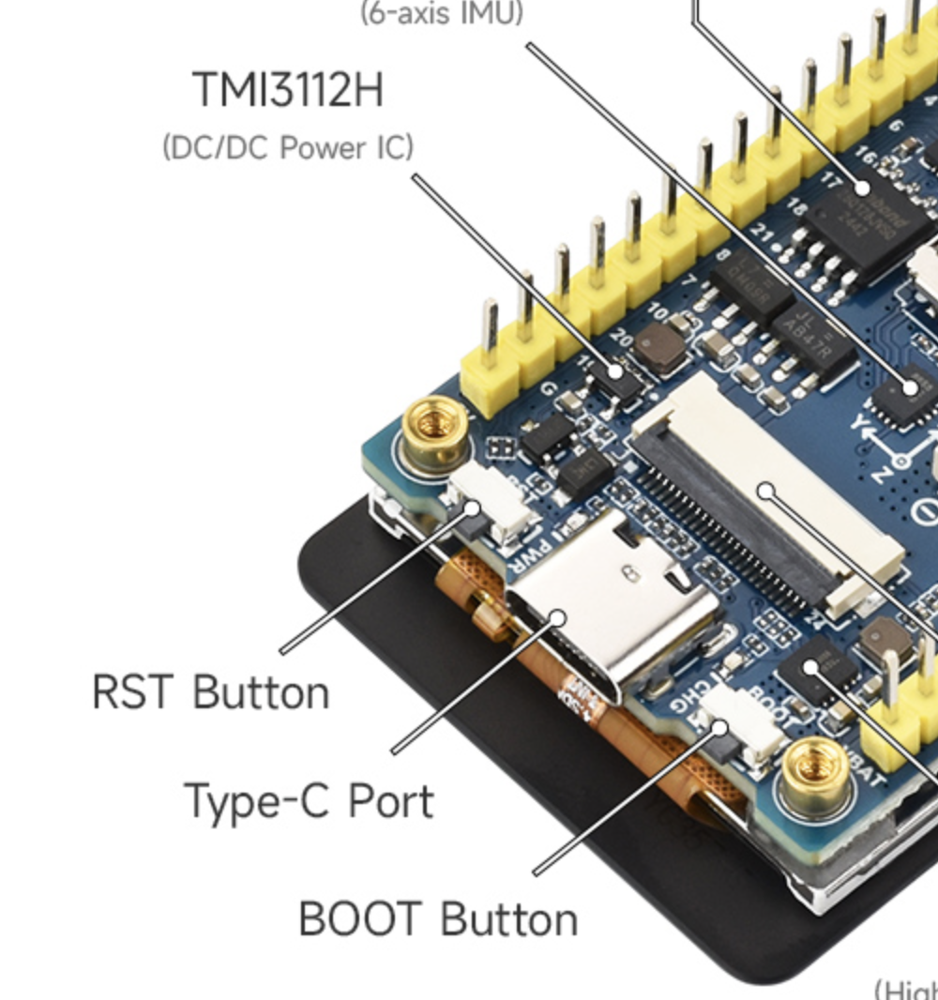
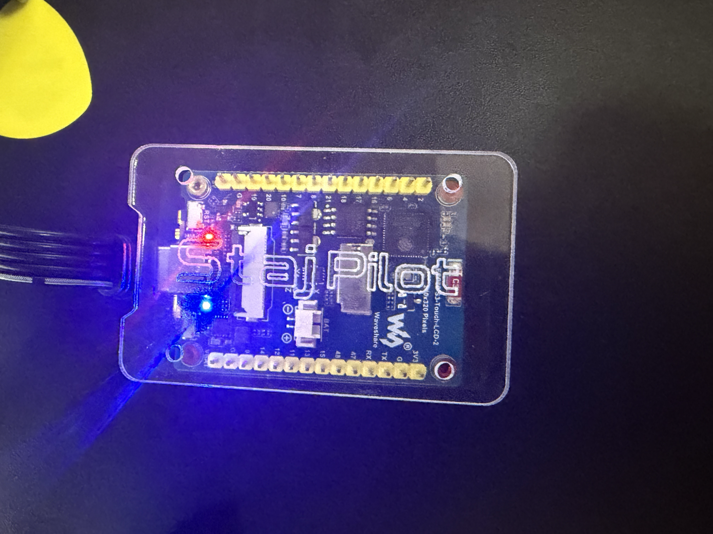

# StajPilot — Waveshare ESP32-S3-Touch-LCD-2

[Read in English](README.md)

▶️ **[유튜브로 보기](https://youtu.be/kLVWh-ry95s)**

캠퍼 프로파일러 플레이어용 터치스크린 MIDI 컨트롤러이며, Waveshare
ESP32-S3-Touch-LCD-2(2인치 320×240 터치 LCD) 보드로 만들어졌습니다.
보드 자체 가격은 **$15** 정도인데도 터치 조작이 온전히 다 됩니다 —
StajPilot을 저렴하고 부담 없이 처음 써보기 좋은 방법입니다.

**베타 버전이 나왔습니다.** 작다고 성능이 떨어지는 게 아니에요 —
오히려 여러 제스처로 숨겨진 기능이 꽤 많습니다.

> ⚠️ **이 보드를 구매하시나요?** 반드시 **터치가 포함된 버전**으로
> 구매하세요 — StajPilot이 동작하려면 터치 패널이 필수입니다. 카메라는
> 필요 없으니 카메라 포함 버전은 피하세요. 이 보드는 옵션이 꽤
> 다양하니 주문 전에 정확한 옵션을 잘 확인하세요.

궁금한 점은? [인스타그램](https://www.instagram.com/stajpilot) DM 주세요 —
확인하는 대로 답변드립니다.

## 기능

- 뱅크/릭 탐색 — 125개 뱅크 × 5개 슬롯, 화면 버튼이나 뱅크 next/prev로
  이동, 캠퍼와 항상 양방향 동기화
- 릭 정보 실시간 표시 — 릭 이름, 앰프 이름, 게인 레벨(10단계 컬러
  그라데이션), 템포, 고정 이펙트 on/off까지 전부 캠퍼에서 실시간으로
  받아옴
- 8개 메인 이펙트 슬롯을 각 이펙트 종류별 색상/아이콘으로 on/off
  한눈에 표시
- 튜너 2가지 모드 — **일반 모드**(정수 센트, 표준 ±2 인튠 기준)와
  **파인튜닝 모드**(소수점 단위 정밀도, 더 촘촘한 그래프, 더 좁은
  인튠/근접 범위), 인튠 시 화면 테두리 초록색으로 표시
- 탭 템포 — TAP 칸 터치로 설정, 길게 누르면 숫자 키패드로 정확한 BPM을
  직접 입력하고 원하면 캠퍼에 바로 적용도 가능
- 모프(Morph) — 이미 켜져 있는 슬롯을 한 번 더 누르면 릭을 다시
  불러오는 대신 모프 실행
- 모프 게이지 바 — 모프 진행 위치를 왼쪽 빨강, 오른쪽 파랑
  그라데이션으로 시각화해서 한눈에 확인 가능
- 확대 모드 — 릭/곡 이름을 화면 가득 크게 키워서 멀리서도 잘 보이게
  표시
- 블루투스 MIDI 3대 동시 연결 — 연결된 기기 현황이 화면에 표시되고,
  USB로 캠퍼에 그대로 전달
- MIDI 기기 우선 검색 — 블루투스 스캔 시 미디로 사용되는 기기를
  우선적으로 보여줘서, 관련 없는 블루투스 기기들 사이에서 헤매지
  않아도 됩니다
- 블루투스 화이트리스트 — 사용하실 기기를 미리 등록해서 그 기기만
  정확히 골라 연결할 수 있고, 다른 블루투스 기기가 의도치 않게
  연결되는 것도 방지합니다
- 호스트 모드 지원 — USB-A 포트는 다른 양방향 기기를 위해 양보할 수
  있습니다 (이 경우 전원 공급이 가능한 OTG 어댑터가 추가로 필요합니다)
- WiFi 송 모드 설정 페이지 — 4.3인치 보드의 송 모드와 동일하게, 뱅크/
  슬롯마다 곡 이름을 붙일 수 있음
- 송 모드 다국어 지원 — 한글, 악센트 포함 라틴 문자 등 다양한 언어로
  곡 이름을 표시할 수 있습니다 (지원 언어 확대 중)
- 밝기, 송 모드, 이펙트 전환 애니메이션, 파인튜닝 모드 등 설정 다
  개별 토글 가능

> **⚠️ 주의**
>
> 캠퍼 플레이어 본체는 버튼 자체에 들어오는 조명과, 그 위에 따로
> 박혀있는 색상 LED(뱅크 식별용)를 함께 사용합니다. 이 둘은 원래
> 완전히 동일하거나 거의 동시에 움직입니다. 보다 동기화 되게 개발하는
> 것이 StajPilot의 기본 개발 방향입니다. 눈에 띄는 지연이 생길 경우
> 캠퍼에 많은 부하가 걸리고 있다는 신호이거나, 연결된 기기에서 신호를
> 처리하지 못하는 병목의 신호일 수 있습니다. 이는 캠퍼에게 너무 많은
> 요청을 하거나, 미디 기기가 데이터를 빠르게 처리하지 못해서 발생하는
> 현상입니다. 그들도 양방향 통신 중에는 폴링(polling)을 피하라고
> 권고하고 있습니다. 심해지면 캠퍼가 빨간 불빛 에러를 내며 프리즈될
> 수 있습니다. StajPilot 사용 중 눈에 띄는 지연을 발견하시면 반드시
> 알려주세요.

## 캠퍼 플레이어와의 MIDI 통신

StajPilot은 캠퍼 플레이어의 양방향(bi-directional) 모드로 동작하며,
직접 요청을 보내기보다는 캠퍼가 자동으로 스트리밍해주는 데이터를
최대한 활용합니다 — 양방향 모드일 때는 무거운 요청 트래픽을 피하는
게 좋습니다. 일부 상세 데이터는 이 자동 스트림에 포함되지 않아 직접
요청이 필요한데, 이런 요청들은 가능한 한 선택적으로 두어서 사용자가
원하면 끌 수 있게 했습니다. 전체 MIDI 레이어는 안정성과 캠퍼 플레이어
자체 시스템에 걸리는 부하를 낮게 유지하는 데 중점을 두고 설계되었습니다
— 스트리밍되는 데이터 자체는 계속 실시간으로 유지되고, 그 위에 추가
요청을 쌓지 않는 것이 핵심입니다.

## 설치하기

**가장 쉬운 방법: 브라우저에서 바로 플래시** — 별도 소프트웨어 설치 없이,
크롬이나 엣지 데스크톱 브라우저만 있으면 됩니다:

### 👉 [stajd.github.io](https://stajd.github.io/)

목록에서 "Waveshare ESP32-S3 2.0"을 선택한 다음:

1. 보드의 **BOOT** 버튼을 누른 채로 유지하세요. 누른 상태에서 USB-C
   케이블을 보드의 Type-C 포트에 연결하고, 컴퓨터에 연결하세요. 화면을
   확인하세요: **까맣게(빈 화면)** 바뀌어야 합니다 — 이게 성공했다는
   신호이고 보드가 업로드 모드에 들어간 것입니다(평소 화면이 그대로
   보인다면 실패한 것이니 다시 시도하세요). 화면이 까매지면 BOOT
   버튼을 2초 정도 더 누르고 있다가 그다음에 손을 떼세요.

   

2. 사이트에서 **Connect & Flash**를 클릭하세요.
3. 팝업창에 컴퓨터의 모든 포트가 나열됩니다 — 이 보드에 해당하는 포트를
   선택하고 **Connect**를 클릭하세요.
   - **Mac에서는**: `usbmodem`과 `USB JTAG/serial debug unit`이 함께
     포함된 항목 하나를 찾으세요. `Bluetooth-Incoming-Port`나
     `debug-console`은 무시하세요 — 보드가 아닙니다.
   - **Windows에서는**: 포트가 설명 없이 그냥 `COM3`, `COM4` 등으로
     표시됩니다. 어떤 것인지 확실하지 않다면, 보드를 뽑아서 목록에서
     사라지는 포트를 확인한 다음, 다시 꽂고 그 포트를 선택하세요.
4. **Install**을 클릭하세요. 기기를 지울지(erase) 묻는 창이 뜹니다.
   - **이 보드에 처음 설치하시나요?** 체크하세요 — 아직 저장된 게
     없어서 잃을 것도 없고, 깨끗한 상태로 시작할 수 있습니다.
   - **이미 StajPilot을 쓰고 있고 업데이트만 하시나요?** 체크하지 않은
     상태로 두세요 — 그래야 저장된 설정과 곡 목록이 유지됩니다.
     그다음 **Next**를 클릭하세요.
5. 플래싱이 끝날 때까지 기다리세요 — 진행 중에는 보드를 뽑지 마세요.
6. "Installation complete!"가 뜨면 **Next**를 클릭하고, 모서리의
   **X**로 도구의 메뉴를 닫으세요.
7. 컴퓨터에서 케이블을 뽑고, 캠퍼에 평소처럼 연결하세요 — 이 보드는
   USB-C 포트가 하나뿐이라, 플래싱에 쓴 케이블과 포트를 그대로 캠퍼
   연결에도 사용합니다.

### esptool로 수동 설치

명령줄에서 직접 플래시하고 싶으시다면, [Releases](../../../releases)
페이지에서 이 보드용 최신 릴리즈를 받으시고, 해당 릴리즈의 노트에서
정확한 `esptool.py` 명령어와 플래시 오프셋을 확인하세요.

## 하드웨어

- Waveshare ESP32-S3-Touch-LCD-2
- ESP32-S3, 네이티브 USB + 네이티브 블루투스 (별도 컴패니언 칩 불필요)
- 2인치 320×240 터치 LCD
- GPIO 핀은 StajPilot에서 사용하지 않으므로 필요 없으면 제거해도
  무방합니다 — 다만 제거할 때 기기가 손상되지 않도록 주의하세요.
  꼭 제거하지 않아도 됩니다 — 핀을 그대로 둔 채로 M2 스탠드오프로
  커버만 달아서 활용하셔도 됩니다.
- 보드 뒷면이 노출되어 있습니다 — 지금은 M2 스탠드오프 스페이서와
  커버를 3D 프린트해서 막는 정도면 충분합니다. 뒷판에 맞는 커버 DXF
  도면을 제공해 드립니다 — **한국 거주자 한정입니다** (배송 문제로
  국적과 무관하게 한국에 거주하시는 분이면 외국인도 가능합니다).
  [인스타그램](https://www.instagram.com/stajpilot) DM으로 신청해
  주세요. 도면 파일은 무상으로 배포해 드리고, 실물 아크릴 커버도
  준비되어 있어 선착순 20명에게 무상으로 배포합니다.

  

  
